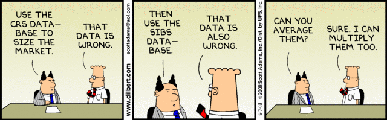

# Overview

```{r, include = FALSE}
#just so I can use emoticons
#devtools::install_github("hadley/emo")
library(emo)
```

For this unit, we will discuss different types of data and how data type influences the analysis approach.


```{r cartoon-data,  echo=FALSE, fig.cap='You might not want to get yourself that kind of data. Source: dilbert.com.', out.width = '80%', fig.align='center'}

```


# Objectives

* Understand different types of data 
* Know that different data types require different analysis approaches
* Know different base data types in R and how to deal with them
* Know about important data structures in R and how to deal with them


# What is data

Broadly speaking, we can define data as anything that (potentially) contains information. Data can be images, sound, video, text, or a combination of any of these. You most likely encounter data in spreadsheets, with observations as rows and variables as columns. However, data is getting much more varied and complex. Data from fitness devices such as Fitbits, Tweets, Facebook posts, purchasing behavior, movement, etc. are all streams of data that can contain useful information.

In the following video, [Jeff Leek](http://jtleek.com/) discusses what data is.

<p>
<iframe width="560" height="315" src="https://www.youtube.com/embed/sRArT81TVEM" frameborder="0" allowfullscreen></iframe>
</p>

The kind of data determines the amount of processing that needs to be done before analysis. Somehow you need to turn your data into something that you can analyze. While analysis of images, video, and text is undoubtedly interesting, it is not the focus of this course. But you are still welcome to use such sources of data for your project. The course will focus on the data source that you are most likely to encounter in your analyses. And that data source is quite likely the "(messy) spreadsheet" type, containing bits of information collected on individuals.


# Types of Variables

We usually refer to pieces of data/information (e.g., gender and age) as variables. Different types of variables exist, and depending on the type, the analysis will be different. The main categories are:

__Quantitative:__ This data type, also called _interval_ data, generally allows on to do certain mathematical operations, e.g., subtraction or addition. Different subcategories exist:

  * Continuous: Can in principle be any number. Examples are height, weight, age, etc.
  * Discrete: Can only take discrete values, e.g., the number of siblings a person has. 
  * Fraction/Proportion: Continuous but between 0-1.
  * Sometimes other special forms (e.g., only positive, only in some range).

__Qualitative:__ Broadly speaking, qualitative data are those that do not allow one to perform any mathematical operations such as subtraction or addition. Types of such data are:

* Descriptive, e.g., free text data from participant interviews.
* Categorical, e.g., hair color, ethnicity. No ordering is possible. A special and common case of categorical is data with 2 categories, e.g., yes/no, dead/alive, diseased/healthy.
  
__Ordinal:__ This is usually considered a type of categorical variable, but it is worth thinking about it as something on its own. Ordinal data fall in between being strictly quantitative or strictly qualitative. For instance, if a question asks a person to rank their level of a pain on a scale from 1-10, a 7 is clearly higher than a 6, and a 6 higher than a 5. But it's unclear if the difference between 5 and 6 is the same as 6 and 7. Thus it is not clear if one can do operations like subtraction (to get a difference of 1 in each case). Another example is level of education, which a survey might collect in categories of 'no high school', 'high school', 'some college', 'college degree', 'graduate degree'. We could code that with numbers 1-5, and in some sense these items are ordered, but it's unclear if one is justified in considering the difference between 'high school (2)' and 'some college (3)' the same as 'some college (3)' and 'college degree (4)'. 


# Analysis approaches based on data
The type of variables will influence the analysis approach. That's especially true for the outcomes of interest, less so for the independent, predictor variables. 

Methods applied to quantitative outcomes are usually referred to as __regression approaches__, with different variants depending on the subtype (e.g., linear regression for continuous, Poisson regression for discrete). Methods applied to categorical outcomes are usually referred to as __classification approaches.__[^1] If you have an ordinal outcome, you can use [__ordinal regression__](https://en.wikipedia.org/wiki/Ordinal_regression). Alternatively, you can treat the outcome as unordered categorical or as continuous (depending on how you code them, i.e., in R as a factor or numeric). There are no rules as to when it is ok to treat an ordinal variable as fully quantitative. It is often done but needs to be justified. You can always treat it as categorical, but then you lose some information, namely the ordering.

In the machine learning literature, _supervised_ learning refers to cases when we have a specific outcome of interest. This kind of data is most common. For data where there is no clear outcome, analysis methods are usually referred to as clustering approaches and are also called _unsupervised_ learning methods. 

We will discuss and apply some of those methods in more detail when we begin our discussion of analysis methods. 

[^1]: Logistic regression, which you might be familiar, is used for classification. However, the underlying model predicts a quantitative outcome (a value between 0 and 1 usually interpreted as a probability), which is then binned to make categorical predictions.


# Working with different data types in R
To efficiently work with data in R, you need to understand how the types of data described above are represented in and handled by R. 

The following is a summary of the most important data types in R. I'm also listing useful packages to deal with them. You have already seen some of the information I describe below. Now would be a good time to revisit the _Types_ section of the RStudio [programming basic primer](https://rstudio.cloud/learn/primers/1.2) and to revisit [chapter 3 of IDS](https://rafalab.github.io/dsbook/r-basics.html).


## Basic data types

__Characters/strings:__ A string is a collection of characters. You will often hear the labels "character" and "string" used interchangeably to describe a variable. Strings are the most flexible variable type. Everything can be a character string. Unfortunately, you cannot do a lot of analysis with them. For instance, if you have the numbers 2 and 3, you can add and subtract. But if you code those numbers as characters "2" and "3", you can't do much with them. Thus, transforming characters into other, more useful categories (if applicable) is a common task. It is common that you read in some data and there is a variable which should be numeric, but some entries are not (e.g., the original spreadsheet shows something like "<10"). In this case, R reads all of these variables as characters. You then have to go in, clean the "<10" value, and convert the rest to numeric. Sometimes you do want to work with strings directly. For that purpose, the [`stringr` package](https://stringr.tidyverse.org/) in R is very useful. To learn some more about strings, work through [the _Strings_ chapter (14) of R4DS](https://r4ds.had.co.nz/strings.html), and do the exercises. __I'll ask about the content of this chapter in the quiz.__ 

It is quite likely that you will need to work with strings at some point during a data analysis, even if it is only to find specific values, clean up variable names, etc. Thus, learning more about this topic is a good idea. [The _string processing_ chapter (25) of IDS](https://rafalab.github.io/dsbook/string-processing.html) contains further good material that is worth working through. (I won't as any quiz questions on that.)

A very powerful, and also very confusing way to deal with strings is to use what are called _regular expressions_. This concept applies to any programming language, not just R. Both the R4DS and IDS readings above cover this topic. 


__Factors:__ That's what R calls categorical variables. They can be ordered/ordinal or not. You need to make sure variables that should be coded as a factor are, and that those that shouldn't be aren't. For instance, you might have a variable with entries of 0, 1, and 2. Those could be numeric values, e.g., the number of siblings a person has. Or it could be a factor coding for 3 types of ethnicity (unordered), or 3 levels of socioeconomic status (ordered). You need to make sure it is coded as factor or numeric, based on what you know about the variable. An excellent package to work with factors is the [`forcats` package](https://forcats.tidyverse.org/). To learn some more about factors, work through [_Factors_ chapter (15) of R4DS](https://r4ds.had.co.nz/factors.html), and do the exercises. __I'll ask about the content of this chapter in the quiz.__ 

__Logical:__ You can think of a logical variable as a type of categorical variable with 2 categories, TRUE and FALSE. Alternatively, in R 0 is interpreted as FALSE and 1 as TRUE. You will use those logical values often when checking your data, e.g., if you want to see if your variable `x` is greater than 5, then the R command `x>5` will return either TRUE or FALSE, based on the value of `x`. 

__Numeric (double/integer:__ Numeric values that are either integers or any other numeric value (double). You generally do not need to care too much how exactly your numeric values are coded. Often, you can treat integers as general numeric (which in R is `double`). You might rarely come across a case where some analytic method or other bits of code requires integers to be specified as such. In R, you can use the `as.integer()` function to convert general numeric values to integers. You don't really need any other special packages in R to deal with numeric values.

__Date/time:__ While dates are a type of continuous numeric variable, you should assign the date class explicitly in R, which allows you to do more with them. The [`lubridate` package](https://lubridate.tidyverse.org/) is a good one to work with dates. Others exist. To learn some more about dates and times in R, work through [_Dates and times_ chapter (16) of R4DS](https://r4ds.had.co.nz/dates-and-times.html). You should consider working through the [_Parsing Dates and Times_ chapter (26) of IDS](https://rafalab.github.io/dsbook/parsing-dates-and-times.html). __I will not ask about the content of either source in the quiz.__ 


## Data structures in R
The basic data types in R are usually combined into larger objects. The main ones in R are described in the following.

__Vectors:__ vectors are a simple collection of elements in a single row or column. In R, the easiest way to create vectors is with the `concatenate` command, `c()`. An example is `x1 <- c(3,12,5)`. A single vector can contain only one element type (e.g., all characters or all numeric). If you try to mix and match, everything ends up as a character. Type the command for `x1` and  `x2 <- c(6, 5, 'h')` into R and apply the `class()` command to both `x1` and `x2` and note the difference.

__Matrices:__ A matrix is a collection of elements in rows and columns. A matrix can contain only one element type. You can think of a matrix as a collection of `horizontal vectors` stacked on top of each other or `vertical vectors` next to each other. 

__Data frames:__ A data frame has the same shape as a matrix, i.e., it is a collection of elements in rows and columns. The critical difference is that each column of a data frame can contain elements of different types. This makes it ideal for storing data, with each row and observation and each variable in a column, and different columns potentially with different data types. E.g., column 1 could be age and numeric, and column 2 could be gender and be categorical, etc.

__A list:__ Lists are the most flexible data types in R. You can combine different elements as in data frames. Further, each element can be of varying length. For instance, you could have the first list element contain a person's name, the second list element their age, the third their address. You can even have other elements inside lists, for instance, you could have a data frame as a list element containing the names and ages of the person's parents. Lists are very flexible, and if you get deeper into data analysis, you'll be working with them. The downside is that because they are more flexible, they can also be a bit more confusing to work with. With enough practice, you'll figure it out. Also note that almost every function in R that returns something a bit more complicated to you (e.g., the result from a linear fit), returns it as a list.

Other types of data structures exist; they are often introduced by specific R packages. An important one to know is the `tibble` which is a type of data frame used in the `tidyverse`. It is similar, but not exactly like a data frame. You can read more about `tibbles` [on its package website](https://tibble.tidyverse.org/) and in [R4DS chapter 10](https://r4ds.had.co.nz/tibbles.html).


In the following video, [Jeff Leek](http://jtleek.com/) talks about the types of data and structures I described above. He shows some R/coding examples and also discusses the important concept of missing values and `NA`.

<p>
<iframe width="560" height="315" src="https://www.youtube.com/embed/T9n7j8180GQ" frameborder="0" allow="accelerometer; autoplay; encrypted-media; gyroscope; picture-in-picture" allowfullscreen></iframe>
</p>


## Complex data types

It is impossible to cover in detail all the different types of data and how to process them in R. The following are very brief descriptions of common complex data types and a few pointers for resources that allow you to work with such data in R.

__Timeseries:__  A very useful set of tools to allow times-series work in R is the set of packages called [the tidyverts](https://tidyverts.org/). CRAN also has a [Task View for _Time Series Analysis_.](https://cran.r-project.org/web/views/TimeSeries.html) (A _Task View_ on CRAN is a site that tries to combine and summarize various R packages for a specific topic). Another task view that deals with longitudinal/time-series data is the [_Survival Analysis_ Task View](https://cran.r-project.org/web/views/Survival.html).


__Omics:__ The [bioconductor](https://www.bioconductor.org/) website is your source for (almost) all tools and resources related to omics-type data analyses in R.


__Text:__  Working with and analyzing larger sections of text is different from the simple string manipulation discussed above. These days, analysis of text often goes by the term _natural language processing_. Such text analysis will continue to increase in importance, given the increasing data streams of that type. If you are interested in doing full analyses of text data, the [`tidytext` R package](https://juliasilge.github.io/tidytext/) and the [Text mining with R book](https://www.tidytextmining.com/) are great resources. A short introduction to this topic is [The _text mining_ chapter (27) of IDS.](https://rafalab.github.io/dsbook/text-mining.html) 


# Some data terminology

I have likely already used some or all of the following words when describing data, but I figured a central location where they are defined explicitly might be useful. 

__Variable:__ Any quantity that we record like height, weight, income, or species type. In R, it is most common, that each variable is stored as a column in a data frame. The column name should be the name of the variable. 

__Observation:__ An observation is a recording of the different variables for a single unit of analysis. Usually an individual, e.g., a single human or animal, but it could also be a picture or video, a county, a city, or whatever our level of observation is. For each observation, values for the different _variables_ should be available. In R, it is most common that each observation is stored as a row in a data frame.

__Outcome (variable):__ The variable of main interest for our analysis. This can be a single outcome (most common) or multiple. For instance, the main outcome might be if an individual survives or dies. Or it could be their BMI, or it could be if a given picture contains a cat or not.  

__Dependent (variable):__ An alternative name for _outcome_.

__Predictor (variable):__ All variables that are not the outcome, which we use to see if we can predict the outcome. For instance, if we wanted to predict the price of houses, we could use the square footage of each house and the school district as the predictors.

__Feature (variable):__ An alternative name for _predictor_ often used in the machine learning literature. They are/mean the same.

__Independent (variable):__ An alternative name for _predictor_, most often used in the statistical literature.

__Exposure (variable):__ A name for a predictor variable of particular interest. For instance, if we wanted to study if the daily duration of exercise had an impact on BMI. We would consider BMI our outcome, exercise duration our exposure (our main predictor of interest), and any other variable we record (e.g., a person's age and gender) as other predictors (sometimes called covariates). The term exposure is common in the biomedical and related disciplines, not so much in other areas.

__Labeled data:__ If we have data for which there is a specific outcome of interest and we know it, it is called labeled data. For instance, if we had a lot of pictures of tissue samples, and someone had gone through them and labeled them as cancerous or not cancerous, it is labeled data. Labeled data (the most common type) is usually analyzed using _supervised_ analysis approaches.

__Unlabeled data:__ If we have data for which there is either no specific outcome variable of interest or we do not know it, it is called unlabelled data. For instance, if we had a lot of pictures of tissue samples, and we knew that some showed cancerous tissue and others not, but we didn't know which are which, it is unlabeled data. Similarly, if we had pictures of different tissue samples (or say a number of gene sequences) and all we wanted to know is if some samples are more related to each other than others, but there is no main outcome, it is considered unlabeled data. Unlabeled data is usually analyzed using _unsupervised_ analysis approaches.