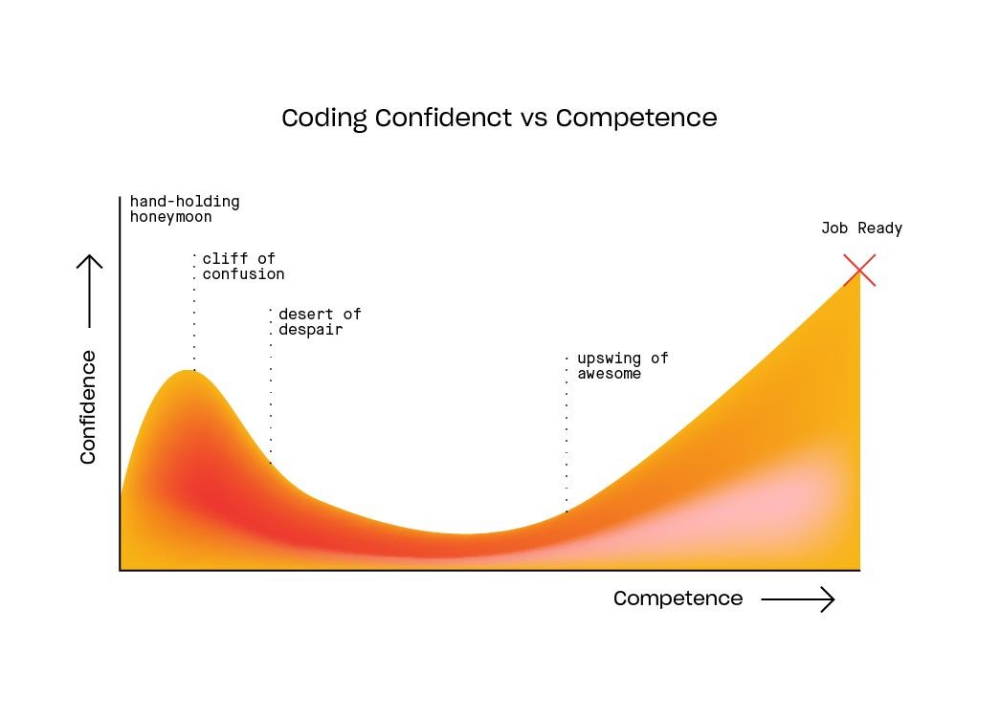

# Overview
In this module, we will talk a bit about writing code in R. This is likely the one unit which will have the greatest diversity in pre-existing knowledge. Some of you might already have enough R knowledge that this will just be a quick refresher. 

**For those among you who have not used R or any other programming language before, this unit (and everything else related to R in this course) will be time-consuming. Be prepared to put in a good bit of time and effort. Budget your time accordingly and plan ahead! If you do, I'm fairly certain you will find it worth it. If you are not able or willing to allot the time needed to learn enough R to make things work, this course might not be ideal for you.**


# Learning Objectives
* Gain starting knowledge of R coding
* Become familiar with the `tidyverse`
* Become familiar with resources that help you learn R 

# Learning to code
R (or any other programming language) is best learned by "doing it". You will learn more R as we go along, but the focus of the class is on data analysis, so while I will provide you with resources to figure out the R bits, outside of this module we will not focus on 'learning R'. You will learn by doing as we go through the course. As with anything, the more you practice, the better you will get. You should approach learning to code with an attitude of _fearless curiosity_. You will get stuck, you will get frustrated with some weird error message in your code (still happens to me at least once a week), and you will eventually figure it out. Make use of the great resources that are out there. They are all listed below and in the _Resources_ section.

This figure illustrates the journey of learning to write code:

```{r datacartoon,  echo=FALSE, fig.cap="The journey of learning to code. [From this Source.](https://www.thinkful.com/blog/why-learning-to-code-is-so-damn-hard/)", out.width = '100%', fig.align='center'}

```

It is [from this good article](https://www.thinkful.com/blog/why-learning-to-code-is-so-damn-hard/). Read the article, or read at least the beginning. 

My goal is that during this course, you will reach the beginning of the _upswing of awesome_, at least when it comes to being able to use R to perform data analyses. But to get there, you'll have to go over the _cliff of confusion_ and through the _desert of despair_, and I'm confident that you'll get there and won't be stuck in the _hand-holding honeymoon_. In fact, at times I'm providing you less detailed instructions than I could to get you quickly to the stage where you have to figure out bits yourself. I guess one could say that instead of hand-holding, I let you stumble and fall some, and then will help you to get back up `r emoji::emoji('smiley')`. It might feel a bit more frustrating at least initially, but it's a much better way to learn.

It goes without saying that learning to code (or learning anything else) is not a linear process. Even after many years of coding and using R, I regularly encounter the _cliff of confusion_ and the _desert of despair_ if I'm trying to do something new that I haven't done before and invariably get stuck.


# Learning the basics of R

Going through the resources below and practicing the material will likely take a good bit of time for those new to programming. I estimate 20+ hours! You will also likely have to come back and revisit R coding throughout the course. Be prepared to spend a good bit of time learning some coding. I think it's a skill that's worth the effort `r emoji::emoji('smiley')`.

*Note: If you already know some R, most of these exercises will be refreshers. You can decide which ones are useful and which ones are not.*

RStudio is starting to develop [a nice set of online tutorials they call Primers](https://rstudio.cloud/learn/primers). (It's free, but you might need to create an account/log in). I am recommending the primers highly. If you are new to R, start with the `The Basics` section, work through the tutorials. 

_Note: Some of the bits surrounding the exercises are somewhat strange. You can generally type anything you want into the R boxes, and you always get a 'that's right' kind of message. The R package that is used to write this tutorial is in the early stages of development and is not full-featured yet. I'm sure it will get better over time. The whole tutorial should still work._

_Note: There are two ways of assigning something to an object in R, one can write `x <- 2` or `x = 2` and often (but not always) you can use either. People argue about which way to do it. In the RStudio tutorial, they do it the first way. If you are completely new to programming, I recommend the first version, i.e. `x <- 2`. The problem is that most other programming languages do it the second way, so if you learned to code in another language first (like I did), it's more natural to write `x = 2`. It's your choice. Just be aware that both notations exist. When I write code, I usually do a mix (without any logic to it). In R, you can also write this in the opposite direction, i.e. `2 -> x`. If you are new to programming this isn't generally recommended, but some online R personalities will assign variables this way._

If you want to practice some basic coding further, I suggest you go through [chapters 2 and 3 of IDS](https://rafalab.github.io/dsbook/). Continuing on to chapter 4 is a good idea. Alternatively, pick any other source you like, e.g. those listed in the resources section of this course, or anything else you find. (If you find something not listed that is really useful, feel free to share!)


# More R coding 

We only focus explicitly on R coding in this module. That is obviously not enough to become proficient at it. For the rest of the course, I expect you to learn the coding bits you need to get things done _on the side_. I understand this will be a challenge. Don't hesitate to seek help. The [R Studio Primers](https://rstudio.cloud/learn/primers/) cover many of the coding related topics we will use in this course, so go through any and all resources you find useful whenever you are able (or when you need to know). 


# Getting help
Maybe the most important skill for learning any programming language is figuring out how to find and get help with any problem. Google, StackOverflow, and the Internet are your friend. The [Posit Community Forum](https://community.rstudio.com/) is also a great place to ask for help.

If you have a problem with your code, it's likely someone else had the same/similar problem before you and asked a question (and probably got an answer). So search the web, and you'll find something useful most of the time.

```{r versioncontrol,  echo=FALSE, fig.cap='Fortunately rare for R. Source: xkcd.com.', out.width = '60%', fig.align='center'}
knitr::include_graphics("./media/xkcd_wisdom_of_the_ancients.png")
```

In those rare cases when you cannot find information online that helps you figure out your problem, feel free to ask for help. The _Resources_ document describes various ways to get help. 

A great source for answers is asking questions online. Sometimes, people complain that replies to questions they ask online are unfriendly or harsh. While this is at times true, consider that all the people providing answers are volunteers. They're doing it because they want to help others, they don't get paid for it. It is therefore important that the person asking the question does not waste people's time by asking poorly formulated questions or questions that have been previously answered. In general, those kinds of questions get rude replies. If you have done your homework (i.e., searched online first to see if the answer is already available) and can precisely formulate the question/problem, ideally with a reproducible example, the chance that you get an unfriendly reply is very low. 

I have found that a good way of posing question is to write something like this: _"I need help with SPECIFIC PROBLEM, I have searched around and found LINKS/DESCRIPTION OF SIMILAR ISSUES but that doesn't quite solve my problem yet."_ If you have a coding problem, add _"Here is some code illustrating what I want to achieve and where the problem is."_ and then add a [minimal reproducible example](https://stackoverflow.com/questions/5963269/how-to-make-a-great-r-reproducible-example). 

The more you show you've done your homework and are truly stuck (instead of just being lazy and wanting others to do the work for you), and the easier you make it for others to understand what your problem is, the more likely you will get good answers.

If you want to learn more about how to ask a good question online, check out this video by Roger Peng.

<p>
<iframe width="560" height="315" src="https://www.youtube.com/embed/ZFaWxxzouCY" frameborder="0" allow="accelerometer; autoplay; encrypted-media; gyroscope; picture-in-picture" allowfullscreen></iframe>
</p>


As you continue on your coding journey, keep in mind: **The great thing about programming is that you can't really "break" things too much. In the worst case you get an error message. So experiment and try out anything you like!**


